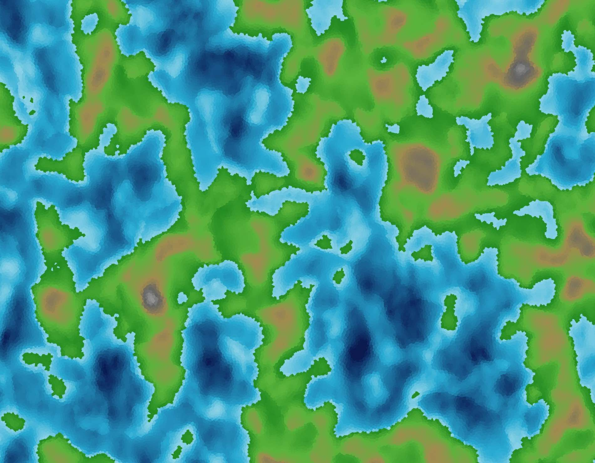

# Realistic map generator



A procedurally generated, infinite 2D world map. Terrain is built on Voronoi diagram, colored based on layered noise for elevation, moisture and temperature. The world is generated in realtime based on the camera position and rendered with Raylib.

The realism that we hope to achieve is not photorealistic rendering, but rather mimicking real-world processes (geology, climatology) as generation rules instead of pure noise. For more information visit wiki page.

## How to run

### Dependencies

- A C++ 20 compiler and CMake (4.2+)
- [raylib](https://www.raylib.com/), [Delaunator](https://github.com/delfrrr/delaunator-cpp), and
  [FastNoise2](https://github.com/Auburn/FastNoise2) — see `external/CMakeLists.txt` for how these
  are fetched in the project.


#### Linux
Raylib has its own dependencies (X11/Wayland, OpenGL, etc.).
Install the packages listed under "Dependencies" in raylib's [Working on GNU Linux](https://github.com/raysan5/raylib/wiki/Working-on-GNU-Linux)
wiki page before building.

### Build
We are using [Ninja](https://ninja-build.org/) as build system generator, but you can fallback to default one if you do not have it installed by ommiting `-G Ninja`.
For better performance add `-DCMAKE_BUILD_TYPE=Release`.
```bash
cmake -B build -G Ninja
```

For ARM-based MacOS:
```bash
cmake -B build -G Ninja -DCMAKE_OSX_ARCHITECTURES=arm64
```

### Compile and Run

MacOS and Linux:
```bash
 cmake --build build && ./build/src/realistic_map_generator
```

Windows:
```bash
 cmake --build build && .\build\src\realistic_map_generator.exe
```

## Controls

| Action | Input |
|---|---|
| Move camera | Hold left mouse button + drag |
| Zoom | Mouse wheel |

# License
